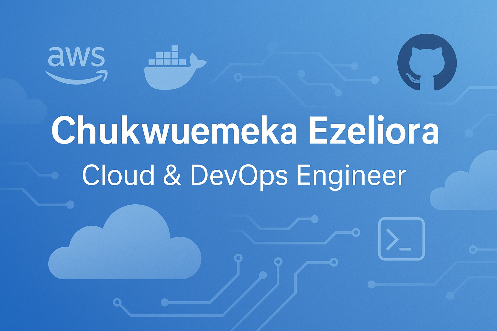

# 👋 Hi, I'm Chukwuemeka Ezeliora

I'm a final-year Computer Science student and aspiring Cloud & DevOps Engineer. I have hands-on experience deploying full-stack applications, building CI/CD pipelines, and implementing cloud infrastructure using tools like **AWS**, **Docker**, **GitHub Actions**, **Terraform** and **kubernetes**.

Currently, I'm working on my project — a **Cloud-Based Continuous Monitoring System for Microservices** — where I'm exploring the use of observability tools and automated alerting in real-time systems.

---

## 💼 Featured Projects
 
### 🧠 [VeriCapture](https://github.com/VeriCapture-source-codes/VERICAPTURE-MAIN)
A misinformation detection tool that uses a full-stack architecture deployed to AWS, with CI/CD pipelines built using GitHub Actions.

### 📈 [NFL player profile Notifications / Sports Alerts System](https://github.com/Therook-sudo/Playerprofile-notification)
An alert system that sends player profile to subscribed users email or SMS, leveraging AWS SNS, LAMBDA , EVENTBRIDGE with python code and NFLAPI

### 🌐 [Cloud Portfolio](https://github.com/Therook-sudo/Therook-sudo.github.io)
This GitHub Pages portfolio, showcasing my skills and project experience.

---

## 🛠️ Tools & Technologies

- **Cloud:** AWS EC2, S3, IAM , SNS , ATHENA , LAMBDA , ECR 
- **CI/CD:** GitHub Actions
- **Containers:** Docker
- **Languages:** Python, Bash, Go
- **Databases:** MongoDB Atlas , PostgreSQL
- **Web Servers:** NGINX, Apache 
- **Monitoring:** Logs, basic observability with Prometheus & Grafana 

---

## 📫 Let's Connect

- 📧 Email: ezeliorae@gmail.com
- 💼 [LinkedIn](linkedin.com/in/chukwuemeka-ezeliora-456a48323)
- 💻 [GitHub](https://github.com/Therook-sudo)

> I'm currently open to internship and junior-level DevOps roles. Let's build something awesome together!
